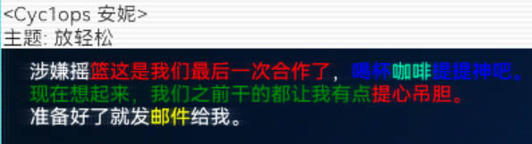

# HacknetFontReplace
Hacknet模组字体切换支持

[English](README_en.md)


## 前置要求

您需要安装[Pathfinder](https://github.com/Arkhist/Hacknet-Pathfinder)后才可使用本模组


## 用法

解压Release包，将所有文件复制到`扩展根目录/Plugins`目录下即可


## 配置文件

配置文件位于`扩展根目录/Plugins/Font/HacknetFontReplace.config.xml`

将项目需要用到的所有字体文件放到:`扩展根目录/Plugins/Font`目录下

```xml
<?xml version="1.0" encoding="utf-8"?>
<HacknetFontReplace>
	<!--大字体；如Display面板中的连接到xxx字样-->
	<LargeFontSize>34</LargeFontSize>
	<!--小字体；如您是本系统管理员字样-->
	<SmallFontSize>20</SmallFontSize>
	<!--UI字体大小-->
	<UIFontSize>18</UIFontSize>
	<!--左上角Ram模块，AppBar等字样字体大小-->
	<DetailFontSize>14</DetailFontSize>
	<!--修改设置字体大小时的增量改变-->
	<ChangeFontSizeInterval>2</ChangeFontSizeInterval>
	<!--是否开启特殊字体解析-->
	<OpenMultiColorFontParse>false</OpenMultiColorFontParse>
	<!--定义字体组-->
	<FontGroups>
		<!--先定义的字体路径优先加载-->
		<FontGroup Name="default">
			<FontPath>Plugins/Font/HarmonyOS_SansSC_Regular.ttf</FontPath>
		</FontGroup>

		<FontGroup Name="desc">
			<FontPath>Plugins/Font/SegoeKeycaps.ttf</FontPath>
			<FontPath>Plugins/Font/HarmonyOS_SansSC_Regular.ttf</FontPath>
		</FontGroup>
	</FontGroups>
	<!--
		当前激活的字体组
		可在扩展中通过Action切换激活的字体组: <ChangeActiveFontGroup Name="desc" />
		激活后存档游戏后重新进入依然有效
	-->
	<ActiveFontGroup>default</ActiveFontGroup>
</HacknetFontReplace>
```


## 特殊字体

### 彩色字体

您可以使用以下效果达到彩色字体

```tex
涉嫌摇{color: Red}篮这是我们最后一次合作了{/}，{color: Blue}喝杯{color: 0 241 162}咖啡{/}提提神吧。{/}
{color: Green}现在想起来，我们之前干的都让我有点{color: Red}提心吊胆。{/}{/}
准备好了就发{color: Yellow}邮件{/}给我。
```

效果如下：



> **用法规则**

1. 首先您需要在配置文件中打开对多色字体的支持!!!
2. 您需要将需要渲染的文本包裹在{}{/}标记内部就像xml标签一样
3. 一对{}{/}标记不能跨多行，否则无效（`游戏原因具体看下面的注意事项`）
4. 目前标记内只支持`color`属性，属性值有两种写法
   - 直接写颜色名，需要存在该颜色且首字母大写，如：Red，Green等
   - 写rgb或rgba格式，之间用空格隔开(**不允许使用逗号等其他分隔符**)
5. 标记也可以写在所有定义文本内容的文件里如xml中的邮件定义或则是代码中
6. 标记可以嵌套使用，内层标记包裹的文本自动继承外侧文本的颜色，同时您也可以单独设置内层文本的颜色


### 局部字体组

`您需要在配置文件中开启特殊字体解析`

您可以使用以下效果达到局部显示不同字体的方式

```tex
123邮件内容邮件内容{color: Red, fontGroup: desc}aa11 223{/}邮件内容邮件内容123
邮件内容邮件内容邮件内容邮件内容邮件{fontGroup: desc}665 14{/}内容邮件内容邮件内容
邮件内容邮件内容邮件内容邮件内容邮件内容邮件内容邮件内容
{color: Red, fontGroup: desc}邮件内容邮件内容邮件内容邮件内容邮件内容邮件内容{color: Blue}邮件  23a   内容{/}你好{/}
```

效果如下：


用法大致同彩色字体，在{fontGroup:  name}中定义需要显示的字体组名即可。

组名在[配置文件](#配置文件) 中的`FontGroup`标签定义。

```xml
<?xml version="1.0" encoding="utf-8"?>
<HacknetFontReplace>
	<!-- ...省略部分配置... -->
    <!--是否开启特殊字体解析-->
	<OpenMultiColorFontParse>true</OpenMultiColorFontParse>
    
	<!--定义字体组-->
	<FontGroups>
		<!--先定义的字体路径优先加载-->
		<FontGroup Name="default">
			<FontPath>Plugins/Font/HarmonyOS_SansSC_Regular.ttf</FontPath>
		</FontGroup>

		<FontGroup Name="desc">
			<FontPath>Plugins/Font/SegoeKeycaps.ttf</FontPath>
			<FontPath>Plugins/Font/HarmonyOS_SansSC_Regular.ttf</FontPath>
		</FontGroup>
	</FontGroups>
</HacknetFontReplace>
```

注意格式需要严格按照上述书写，不能随意加双引号，**非JSON格式**


### 嵌入图片

`您需要在配置文件中开启特殊字体解析`

您可以使用以下效果达到嵌入图片的效果

```tex
图片：{img: test, scale: 0.5}${/}
```

效果如下


用法大致同彩色字体，在{img:  key}中定义需要显示的图片key即可，使用后{}{/}中的每一个字符都会被替换为图片

key在[配置文件](#配置文件) 中的`Image`标签定义。

```xml
<?xml version="1.0" encoding="utf-8"?>
<HacknetFontReplace>
	<!-- ...省略部分配置... -->
    <!--是否开启特殊字体解析-->
	<OpenMultiColorFontParse>true</OpenMultiColorFontParse>
    
    <!--定义图像组-->
	<Images>
		<!-- 定义图像 key则为特殊字体表达式中img的值，图片路径是以扩展根目录为基准的相对路径 -->
		<!-- <Image Key="test">Image/test.png</Image> -->
	</Images>
</HacknetFontReplace>
```


### 字体/图片的旋转与缩放

`您需要在配置文件中开启特殊字体解析`

您可以使用以下效果达到嵌入图片的效果

```tex
图片：{img: test, scale: 1.5, rotate: 15}${/}
```

- img: 图片Key，在配置文件中定义
- scale: 放缩比例，太大会导致游戏计算宽度超出，导致出现换行截断特殊字符语法或其他bug，请注意！
- rotate: 旋转角度，会自动保证旋转后不占用上一行的空间


效果如下


**注意：**如果您缩放的过大会导致游戏计算字体宽度时超出导致字体解析被截断，当您发现出现未知换行时您可以考虑到此方面的原因。

您需要在配置文件中开启特殊字体解析后才可生效

```xml
<?xml version="1.0" encoding="utf-8"?>
<HacknetFontReplace>
	<!-- ...省略部分配置... -->
    <!--是否开启特殊字体解析-->
	<OpenMultiColorFontParse>true</OpenMultiColorFontParse>
</HacknetFontReplace>
```


### **注意**

hacknet部分地方会自动拆分文本为多行，比如邮件中您定义的文本为`{}准备好了就发给我。{/}`，游戏内可能会拆分为两行如下

`{}准备好了就发`

`给我。{/}`

此时会分两次渲染导致标记解析失败，您需要将上面的文本整改为如下部分才可以正常渲染

`{}准备好了就发{}`

`{}给我。{/}`


## Action

新增了ChangeActiveFontGroup标签，可在游戏过程中动态切换标签，例如：

```xml
<Instantly Delay="5">
    <ChangeActiveFontGroup Name="desc" />
</Instantly>
```


## 编辑器提示

为了您的使用体验，我建议您使用Visual Studio Code编辑器，因为它支持XML文件的语法高亮和智能提示。

您可以在Visual Studio Code中安装以下插件来获得更好的翻译体验：

- XML Tools: 提供XML文件的语法高亮和智能提示
- [HacknetExtensionHelper](https://marketplace.visualstudio.com/items?itemName=fengxu30338.hacknetextensionhelper): 提供Hacknet扩展相关的智能提示

如果您安装的HacknetExtensionHelper插件版本大于等于`0.3.3`，您可以在扩展根目录的`Hacknet-EditorHint.xml`文件中通过`Include`标签引用本Mod的[提示文件](.EditorHints/HacknetFontReplace.xml)

```xml
<!-- 扩展根目录下的Hacknet-EditorHint.xml-->
<HacknetEditorHint>
    <Include path=".EditorHints/HacknetFontReplace.xml" />
</HacknetEditorHint>
```


## 关于

若您使用了本模组请在模组说明处注明来源。
